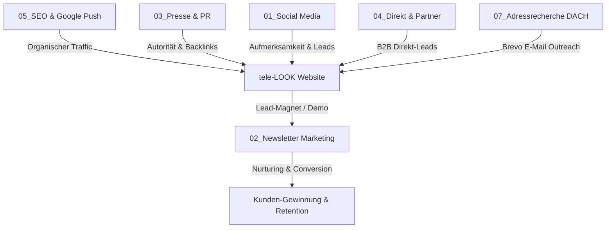

# Master-Marketing-Architektur & Kanal-Map (tele-LOOK)

> **Zentrale Marketing-Zentrale:** `tele-LOOK Marketing`  
> **Ziel:** Skalierbare, kanalsübergreifende B2B-Marketingsteuerung für tele-LOOK mit klaren Zeitplänen, konsistentem Markenauftritt & hoher Conversion.

---

## 1. DIE MULTI-KANAL MARKETING-ARCHITEKTUR

---

## 2. ORDNERÜBERSICHT & VERANTWORTLICHKEITEN

| Ordner-Nummer | Marketing-Kanal | Kerninhalt & Zweck |
| :--- | :--- | :--- |
| `00_allgemein/` | **Wissensbasis & Design** | Sitemap, Master-Spezifikation, Faceless-Strategie & Brand-Guide. |
| `01_Social_Media/` | **Organischer Social Content** | Datumsbasierte Kampagnen auf LinkedIn, Instagram, Facebook, TikTok & YouTube. |
| `02_Newsletter_Marketing/` | **E-Mail Nurturing & Retention** | Zielgruppenspezifische Sequenzen für Interessenten & Produkt-Updates für Nutzer. |
| `03_Presse_und_PR/` | **PR & Off-Page SEO** | Pressemitteilungen für OpenPR, PresseBox & den eigenen SEO-Newsroom. |
| `04_Direkt_und_Partner_Marketing/` | **B2B-Direct & Partner-Sales** | Print-Mailings, Beilagen, Partner-Co-Marketing (Pfeiffer & May, KKC-Koffer). |
| `05_SEO_Keywords_und_Google_Push/` | **Google Dominanz & Keywords** | Master-Keyword-Listen, SEO-Strategie, Helpful Content & Zeitplan. |
| `06_Zukunft_und_Expansion/` | **Skalierung & Neue Formate** | Spielraum für Paid Ads, Messe-Marketing, Podcasts & Webinare. |
| `07_Adressrecherche_DACH/` | **B2B Adressdatenbanken (Brevo)** | Brevo-ready CSV-Dateien für DE, AT & CH (Handwerk, Maschinenbau, FM). |
