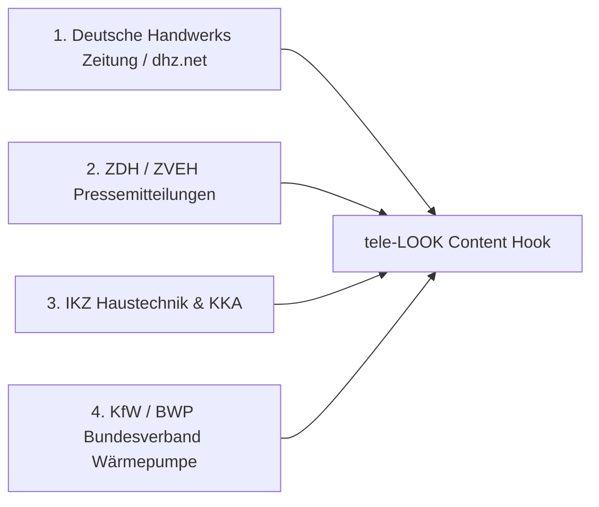

# 📰 News-Jacking & DHZ Gesetzgebungs-Leitfaden (MANDATORISCHER CONTENT-STANDARD)

> **PRIMÄRE BRACHENS-QUELLE:**  
> **Deutsche Handwerks Zeitung (DHZ)** (`dhz.net`) sowie die Fachverbände **ZDH** (Zentralverband des Deutschen Handwerks) & **ZVEH**.
>
> **GRUNDSATZ-REGEL:**  
> Jeder Social-Media-Beitrag (LinkedIn, Instagram, Facebook) und jede Pressemeldung **MUSS sich an aktuellen DHZ-Nachrichten, Gesetzgebungs-Novellen (EEG 2027, GModG / GEG, BEG-Förderung) und Branchen-News orientieren**.

---

## 1. BRANDAKTUELLE NEWS-HOOKS AUS DER DHZ (STAND: 29./30. JULI 2026)

### A. EEG-Novelle 2027 im Kabinett verabschiedet (DHZ 29.07.2026)
* **Die Fakten:** Das Bundeskabinett hat am 29. Juli 2026 die **EEG-Novelle 2027** beschlossen. Die garantierte 20-jährige Einspeisevergütung für neue PV-Kleinanlagen (unter 25 kWp) fällt weg. Es gilt die Pflicht zur Direktvermarktung und Eigenverbrauchs-Maximierung.
* **Kritik aus dem Handwerk (ZDH & ZVEH):** Der ZDH warnt vor Verunsicherung bei Privathaushalten & Betrieben. Die einzig wirtschaftliche Lösung: **Vollständige Koppelung von PV-Anlage & Wärmepumpe (SG-Ready) für maximale Eigenstrom-Nutzung**.
* **Der Schmerzpunkt im Handwerk:** Elektro- & SHK-Betriebe werden von Kunden mit Anfragen zur PV-Wärmepumpen-Nachrüstung überrollt.
* **Der tele-LOOK Link:** Der Elektro-/SHK-Meister nutzt tele-LOOK für den **"3-Minuten-PV-Wärmepumpen-Remote-Check"**. Er schaltet sich per SMS-Link auf Zählerschrank, Wechselrichter & Heizung zu – **ohne 1,5 Stunden im Auto zu sitzen**.

### B. Gebäudeenergiegesetz-Ablösung durch das **Gebäudemodernisierungsgesetz (GModG)** (DHZ Juli 2026)
* **Die Fakten:** Wegfall der strikten 65%-Erneuerbare-Energien-Pflicht. Einführung der **"Bio-Treppe"** (stufenweise Pflicht zur Beimischung von 10% Biomethan ab 2029 bis 60% im Jahr 2040).
* **Der Schmerzpunkt im Handwerk:** Erklärungsnot im Kundendienst. Kunden verlangen Sofort-Beratung, welche Heizung sich zukunftssicher amortisiert.
* **Der tele-LOOK Link:** Die **"Remote-Erstberatung in 60 Sekunden"**. Visueller Vorab-Check des Heizungskellers per Smartphone-Kamera des Kunden.

---

## 2. PRIMÄRE LEITMEDIEN FÜR DAS AUTOMATISCHE NEWS-CHECKING

Vor der Erstellung eines neuen Content-Pieces werden diese 4 Leitmedien geprüft:



---

## 3. FORMEL FÜR DEINE POSTS & PRESSEMITTEILUNGEN

```text
[1. DHZ NEWS-HOOK] 🚨 "Laut aktueller Meldung der Deutschen Handwerks Zeitung (DHZ) hat das Kabinett die EEG-Novelle beschlossen..."
        ↓
[2. SCHMERZPUNKT]  💥 "Für Elektro- & SHK-Betriebe bedeutet das: Telefone stehen nicht mehr still, weil Kunden ihre PV-Anlage sofort mit der Wärmepumpe koppeln wollen."
        ↓
[3. TELE-LOOK USP] 💡 "Statt für jeden Vorab-Check 45 Min im Stau zu stehen: Mit tele-LOOK schaltet sich der Meister in 60 Sek. per SMS-Link auf Zählerschrank & Heizung. Ohne App-Download!"
```
