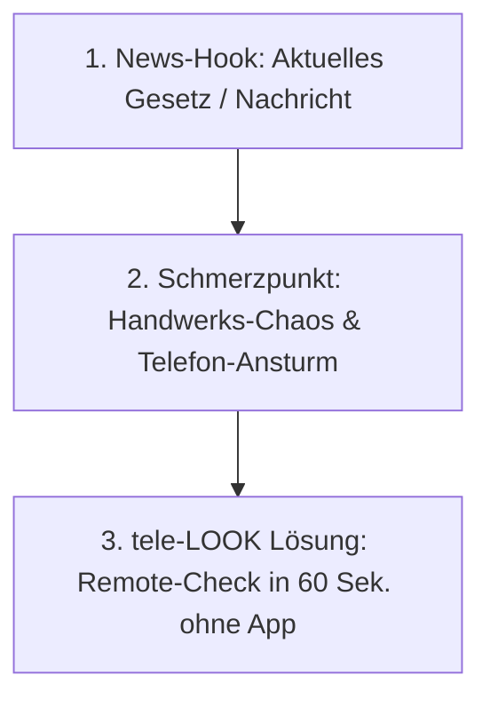

# 📰 News-Jacking & Gesetzgebungs-Leitfaden (MANDATORISCHER CONTENT-STANDARD)

> **GRUNDSATZ-REGEL FÜR ALLE POSTS & PRESSEMITTEILUNGEN:**  
> Jeder Social-Media-Beitrag (LinkedIn, Instagram, Facebook) und jede Pressemeldung **MUSS sich an aktuellen Nachrichten, Gesetzesänderungen (GModG / GEG, KfW-Förderung, F-Gase) und branchenspezifischen News-Hooks orientieren**.

---

## 1. DIE AKTUELLEN NEWS-HOOKS 2026 (STAND: JULI 2026)

### A. Ablösung des GEG durch das **Gebäudemodernisierungsgesetz (GModG)** (Juli 2026)
* **Die Fakten:** Wegfall der strikten 65%-Erneuerbare-Energien-Pflicht. Wiederzulassung fossiler Optionen, aber Einführung der **"Bio-Treppe"** (stufenweise Pflicht zur Beimischung von 10% Biomethan ab 2029 bis 60% im Jahr 2040).
* **Der Schmerzpunkt im Handwerk:** Massiver Erklärungsbedarf bei Endkunden. Das Telefon im SHK-Betrieb steht nicht mehr still. Kunden fragen: *"Was bedeutet das GModG für mein Haus?"*, *"Reicht mein Platz im Keller für Wärmepumpe oder Hybrid?"*.
* **Der tele-LOOK Link:** Der SHK-Meister / Energieberater nutzt tele-LOOK für die **"2-Minuten-Remote-Erstberatung"**. Er schaltet sich per SMS-Link auf den Heizungskeller zu, prüft Stellplatz, Rohre und Zählerkasten – **ohne 1,5 Stunden im Auto zu sitzen**.

### B. Neue KfW-Förderrichtlinien (BEG-Anpassung ab 21. Juli 2026)
* **Die Fakten:** Anpassung der Förderobergrenzen (z. B. 28.000 € für Einfamilienhäuser), Wegfall einzelner Boni, stärkere Einkommensstaffelung.
* **Der Schmerzpunkt im Handwerk:** Kunden sind durch die ständigen Förderungs-Updates extrem verunsichert und verlangen schnelle Bestandsaufnahmen.
* **Der tele-LOOK Link:** Visuelle Bestandsaufnahme vor dem Förderantrag per Live-Video. Dokumentation per HD-Fotoprotokoll für die Förderakte.

---

## 2. NEWS-JACKING CONTENT-MUSTER (FORMEL)

Jeder Post folgt ab sofort dieser 3-Schritt-Formel:

### Beispiel LinkedIn / Instagram Hook:
> 🚨 *"Neues Gebäudemodernisierungsgesetz (GModG) seit Juli 2026: Verunsicherte Kunden stürmen die Handwerks-Hotlines! So retten SHK-Meister ihre Arbeitszeit..."*

---

## 3. CHECKLISTE VOR JEDER CONTENT-ERSTELLUNG

- [ ] **Aktualitäts-Check:** Gab es in den letzten 14 Tagen neue Beschlüsse zu GModG, KfW, Wärmepumpen-Quoten oder Handwerks-Statistiken?
- [ ] **Schmerzpunkt-Verknüpfung:** Wie betrifft diese Nachricht den Arbeitsalltag des Serviceleiters / Meisters (z. B. mehr Anrufe, mehr Beratungsaufwand, mehr Fahrten)?
- [ ] **tele-LOOK USP:** Wie löst tele-LOOK das Problem (Zero-Barrier Browser-Video, AR-tele-PUNKT, PDF-Fotoprotokoll)?
