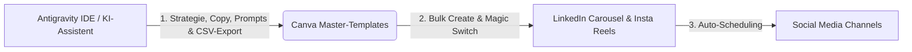

# Faceless SaaS Social Media Strategie & Operativer Leitfaden (tele-LOOK)

> **Konzept & Workflow-Design durch:** Antigravity (Persönlicher KI-Assistent)  
> **Ziel:** Aufbau eines hochprofitablen, skalierbaren "Faceless" B2B-SaaS Accounts auf LinkedIn, Instagram, Facebook & TikTok mit minimalem Zeitaufwand durch die Kombination aus **Antigravity** (Strategie, Copywriting, Batching) und **Canva** (Design, Bulk-Create, Multi-Format-Export).

---

## 1. DIE FACELESS SAAS PHILOSOPHIE: "PRODUCT & VALUE AS THE HERO"

### Warum Faceless perfekt für B2B SaaS (tele-LOOK) ist
In vielen Consumer-Nischen lebt Social Media von Gesichtern und Personal Branding. Im **B2B-SaaS-Bereich** (Handwerk, Facility Management, Maschinenbau, Versicherungen) entscheiden Käufer jedoch nach **harten Fakten, Problemlösung, Zeit- & Kostenersparnis sowie DSGVO-Sicherheit**.

Ein Faceless-Account verlagert den Fokus zu 100 % auf:
*   **Das konkrete Problem** (z. B. "Teure 150 € Diagnosefahrt für einen Schalter-Reset").
*   **Die visuelle Lösung** (Software-Screen-Recordings, tele-PUNKT AR-Zeiger, Vorher-Nachher).
*   **Den ROI & Beweis** (Fördergeld-Rechner 2025/2026, fälschungssichere PDF-Protokolle).
*   **Unabhängigkeit:** Das System skaliert ohne die tägliche Kamera-Präsenz des Gründers.

---

## 2. DIE 4 CONTENT-SÄULEN FÜR TELE-LOOK (FACELESS)

| Säule | Thema & Fokus | Beispiel-Hooks & Content-Formate |
| :--- | :--- | :--- |
| **1. Pain & Problem** | Unnötige Anfahrten, Techniker-Mangel, Schatten-IT (WhatsApp), Abrechnungsverlust | • *"Warum 40% aller Servicefahrten Geldverbrennung sind."* • *"Das WhatsApp-Risiko bei Ihren Technikern (DSGVO-Falle)."* |
| **2. Feature & Proof** | tele-PUNKT, Remote-Taschenlampe, PDF-Protokoll, Zero-App-Access | • Video-Snippet: *AR-Live-Zeiger führt Azubi am Schaltschrank.* • Infografik: *App-Installation vs. WebRTC-Link (0 Sekunden).* |
| **3. ROI & Business Case** | Truck-Roll-Reduktion, Stay-Active/Re-Active HR, BCM, CO₂-Ersparnis | • Carousel: *So sparen SHK-Betriebe 1.200 € pro Monat per Remote-Triage.* • ESG-Grafik: *300 Meter gespart = 60 Min. Video-Call.* |
| **4. Subvention & Policy** | Förderungen 2025/2026 (KfW ERP, BAFA, Digitalbonus Bayern/NRW) | • *"Bis zu 50% Zuschuss für tele-LOOK: Der Förder-Leitfaden 2026."* • *"Das Gesetz des vorzeitigen Maßnahmebeginns beachten!"* |

---

## 3. DAS 2-TOOL-POWER-SYSTEM: ANTIGRAVITY + CANVA

Das Ziel ist ein **automatisiertes, systematisches Vorgehen**, bei dem der tägliche Zeitaufwand auf **unter 15 Minuten pro Woche** sinkt.

### A. Rolle von Antigravity (Persönlicher KI-Assistent)
1. **Strategische Redaktionsplanung:** Erstellung von Monats-Plänen gegliedert nach Zielgruppen (SHK, FM, Maschinenbau, Elektro).
2. **High-Converting Copywriting:** Schreiben von LinkedIn-Texten, Instagram-Captions, Carousel-Slides & Reel-Skripten.
3. **Batch-Generierung (CSV-Export):** Erstellung struktureller Datensätze für Canvas "Bulk Create" (z. B. 20 Tipps, 10 Mythen, 5 ROI-Vergleiche auf einen Klick).
4. **Einwandbehandlungs-Snippets:** Vorlagen für Antworten auf Kommentare und DMs ("Warum tele-LOOK statt WhatsApp?").

### B. Rolle von Canva (Visuelles Studio & Multi-Format-Maschine)
1. **Canva Brand Kit:** Hinterlegen der tele-LOOK Corporate Identity (Logo, Markenfarben, Typografie, Icon-Set).
2. **Master-Template-Bibliothek (3 Kern-Formate):**
   *   *Format 1 (LinkedIn Carousels):* 1080x1350px – Mehrseitige PDFs mit klaren Titeln, Icons und Schritt-für-Schritt-Nutzen.
   *   *Format 2 (Reels / Shorts / TikTok):* 1080x1920px – Dynamische Aesthetic-Stock-Videos oder Screen-Recordings mit großer, gut lesbarer Text-Overlay-Typo.
   *   *Format 3 (Single Static / Quotes):* 1080x1080px – Starke Zahlen, ROI-Zitate oder Checklisten für Instagram & Facebook.
3. **Bulk Create (Serien-Erstellung):** Automatisches Befüllen von Templates mit den Daten aus Antigravitys CSV-Tabellen.
4. **Magic Switch (Format-Konvertierung):** Einmaliges Designen eines LinkedIn-Karussells und automatisches Umwandeln in Insta-Stories oder Reels.

---

## 4. SCHRITT-FÜR-SCHRITT OPERATIVER WORKFLOW (15 MIN / WOCHE)

### Schritt 1: Briefing & Content-Generierung mit Antigravity (5 Min)
Sie geben Antigravity z. B. folgende Anweisung:
> *"Antigravity, erstelle mir 5 LinkedIn-Karussells für die Zielgruppe SHK-Betriebe zum Thema 'Remote-Notdienst-Triage' als CSV-Tabelle für Canva Bulk Create."*

Antigravity liefert direkt die fertigen Texte (Headline, Slide 1-5, CTA, Captions & Hashtags).

### Schritt 2: Bulk-Create in Canva (3 Min)
1. In Canva das vorbereitete **Master-Karussell-Template** öffnen.
2. In der linken Seitenleiste auf **Apps → Bulk Create (Serienerstellung)** klicken.
3. Die von Antigravity erzeugte CSV hochladen oder Daten per Copy-Paste einfügen.
4. Textfelder mit den Variablen verknüpfen und auf **"Seiten generieren"** klicken.
5. *Ergebnis:* 5 komplette, fertige Karussell-Präsentationen innerhalb von Sekunden.

### Schritt 3: Veredelung mit UI-Screenshots & Stock-Footage (4 Min)
*   Kurze GIF-Animations-Snippets vom **tele-PUNKT** (AR-Zeiger) oder UI-Screenshots per Drag & Drop in die vorgesehenen Frames in Canva ziehen.
*   Für Reels: Ein passendes Stock-Video (z. B. Techniker bei der Arbeit oder moderner Büro-Arbeitsplatz) im Hintergrund hinterlegen.

### Schritt 4: Planung & Veröffentlichung (3 Min)
*   Nutzung des **Canva Inhaltsplaners** (oder Buffer / Publer), um die Beiträge direkt für die gesamte Woche auf LinkedIn, Instagram & Facebook zu terminieren.

---

## 5. PLATTFORMSPEZIFISCHE TAKTIKEN (FACELESS B2B)

### 1. LinkedIn (Hauptkanal für B2B-Leads)
*   **Profil-Setup:** Unternehmensseite oder fokussiertes Marken-Profil. Icon = tele-LOOK Logo / App-Icon. Banner = "App-freie Videokollaboration für Handwerk & Industrie".
*   **Format-Fokus:** PDF-Carousels (1080x1350px) und Text-Posts mit Bildschirm-Aufnahmen.
*   **Lead-Magnet Strategie:** *"Kommentiere 'ROI' und ich sende dir unseren interaktiven Rechner & den Förder-Leitfaden 2026 per DM."*

### 2. Instagram & Facebook (Verstärker & Handwerks-Entscheider)
*   **Format-Fokus:** 7-15 Sekunden Reels mit "Aesthetic / High-Quality Stock Footage" oder echten Screen-Recordings + Mehrwert-Text im Bild & detaillierter Caption.
*   **Audio-Trend:** Nutzung von dezenter, professioneller Hintergrundmusik (Instrumental / Lo-Fi / Upbeat Business).

### 3. TikTok & YouTube Shorts (Reichweiten-Hebel)
*   **Format-Fokus:** Kurze Vorher-Nachher-Clips ("Techniker fährt 1 Stunde umsonst vs. 2 Min tele-LOOK Video-Call").
*   **Text-to-Speech / AI-Voice:** Bei Bedarf Nutzung professioneller KI-Stimmen (z. B. ElevenLabs) für kurze Sprecher-Texte aus dem Hintergrund.

---

## 6. DIE "FACELESS AUTHORITY" ENGAGEMENT-STRATEGIE

Da kein persönliches Gesicht im Vordergrund steht, baut der Account Autorität über **aktive Interaktion** auf:

1. **Die 5x5x5-Methode:** Täglich 5 Minuten bei 5 relevanten Branchen-Influencern / Verbänden (z. B. Zentralverband Sanitär Heizung Klima, Handwerkskammern, Facility-Management-Experten) mit fachlich tiefen, wertvollen Kommentaren beitragen.
2. **DM-Automatisierung (ManyChat / Direct Messaging):** Wenn ein User auf ein Reel/Post reagiert ("Schick mir die Infos"), sendet der Bot oder Antigravity-Vorlage automatisch den Link zur Demobuchung oder zum Förder-PDF.

---

## 7. NEXT STEPS /NÄCHSTE AKTIONEN

1. **Ordner-Struktur nutzen:** Wir können ab sofort fertige Content-Pakete direkt in den Ordnern `01_Linkedin`, `02_Instagram` und `03_Facebook` anlegen.
2. **Canva-Templates einrichten:** Ich kann dir exakte Vorlagen-Texte und Raster-Layouts definieren, die du einmalig in Canva anlegst.
3. **Erstes Content-Paket starten:** Sag mir einfach: *"Erstelle das erste 5er-Paket für LinkedIn zum Thema Notdienst-Triage"* und wir legen los!
