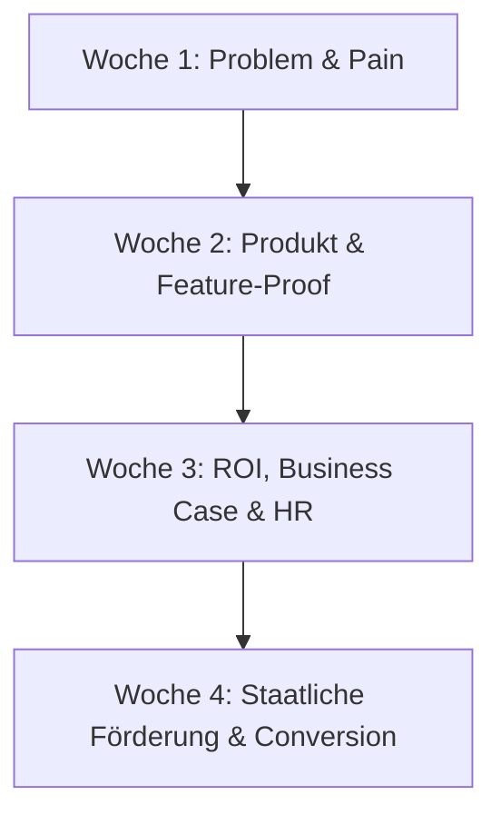

# LinkedIn Content-Strategie & Sequenzieller Redaktionsplan (tele-LOOK)

> **Ziel:** Aufsetzung einer aufeinander aufbauenden 4-Wochen-Content-Sequenz für B2B-Entscheider (Inhaber, Kundendienstleiter, FM-Manager).  
> **Prinzip:** Vom **Problembewusstsein** über die **Lösung & ROI** bis hin zur **staatlichen Refinanzierung & Conversion**.

---

## 1. DIE 4-WOCHEN-KONTINUITÄTS-SEQUENZ (FUNNEL-STRUKTUR)



### Woche 1: Problembewusstsein & Schmerzpunkte ("Pain & Awareness")
*   **Fokus:** Sensibilisierung für teure Ineffizienzen & Schatten-IT.
*   **Post 1 (01.08.2026):** Die wahren Kosten von "Windschutzscheiben-Zeit" (150 € pro Diagnosefahrt).
*   **Post 2 (03.08.2026):** Die DSGVO-Falle: Warum WhatsApp & FaceTime im Kundendienst rechtlich gefährlich sind.

### Woche 2: Die Lösung & Produkt-Beweis ("Product & Feature Proof")
*   **Fokus:** Demonstration der "Smart Simplicity" (WebRTC, App-frei, tele-PUNKT).
*   **Post 3 (06.08.2026):** Das Zero-Barrier-Paradigma: In 60 Sekunden beim Kunden ohne App-Installation.
*   **Post 4 (08.08.2026):** Der tele-PUNKT in Action: Wie Meister Azubis präzise am Schaltschrank anleiten.

### Woche 3: Betriebswirtschaftlicher ROI & HR-Strategie ("Decision & Commercial Value")
*   **Fokus:** Harte betriebswirtschaftliche Argumente & Fachkräftesicherung.
*   **Post 5 (10.08.2026):** Amortisation nach 1 Fahrt: Der ROI-Rechner für SHK- & Elektrobetriebe.
*   **Post 6 (13.08.2026):** Die "Stay-Active" HR-Strategie: Wie erfahrene Techniker vom Büro aus leiten.

### Woche 4: Refinanzierung & Lead-Conversion ("Funding & Action")
*   **Fokus:** Staatliche Zuschüsse 2025/2026 & direkte Demobuchung.
*   **Post 7 (15.08.2026):** KfW & Landesförderungen 2026: Bis zu 50% Zuschuss für tele-LOOK Prozessinnovation.
*   **Post 8 (17.08.2026):** Das Verbot des vorzeitigen Maßnahmebeginns (Förder-Checkliste).

---

## 2. ORDNER- & DATEISTRUKTUR IN `01_Linkedin`

Jeder Beitrag erhält einen eigenen Ordner im Datums-Format `YYYY-MM-DD_post-XX_thema`.

```
01_Linkedin/
├── 00_redaktionsplan_und_sequenz_strategie.md
├── 2026-08-01_post-01_kosten-windschutzscheiben-zeit/
│   ├── post_content.md       <-- LinkedIn-Text, Slide-by-Slide Karussell & Captions
│   └── canva_bulk.csv        <-- CSV für Canva Bulk-Create Import
├── 2026-08-03_post-02_dsgvo-falle-whatsapp/
│   ├── post_content.md
│   └── canva_bulk.csv
├── 2026-08-06_post-03_zero-barrier-app-free/
│   ├── post_content.md
│   └── canva_bulk.csv
└── ...
```
