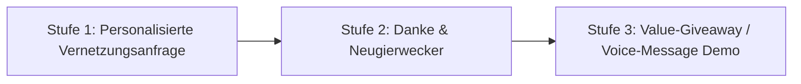

# LinkedIn Organische Akquise-Strategie (ohne Sales Navigator)

> **Prinzip:** Menschlich, respektvoll & lösungsorientiert. Keine stumpfe Verkaufskeule, sondern echtes Interesse an den Schmerzpunkten des Gegenübers (Inhaber, Kundendienstleiter, Meister).

---

## 1. DAS 3-STUFEN OUTREACH-SYSTEM

### Stufe 1: Die Vernetzungsanfrage (Max. 300 Zeichen Notiz)
Vernetze dich gezielt mit Personen über die normale LinkedIn-Suche (Filter: Personen, Ort = Deutschland/Österreich/Schweiz, Branche = Handwerk/Maschinenbau).

* **Vorlage A (Fokus Handwerk & SHK):**
  > *"Hallo [Name], ich verfolge eure Arbeiten im Bereich Haustechnik/SHK mit großem Interesse. Da wir uns in der Branche mit dem Thema 'Effizienz & Vermeidung unnötiger Anfahrten' beschäftigen, würde ich mich hier gerne vernetzen. Viele Grüße, Regina Keller-Sylla"*

* **Vorlage B (Fokus Kundendienst & Serviceleiter):**
  > *"Hallo [Name], beim Stöbern im Bereich Technischer Kundendienst bin ich auf Ihr Profil gestoßen. Da wir Betrieben helfen, die First-Time-Fix-Rate ohne App-Download zu steigern, vernetze ich mich hier gerne. Beste Grüße, Regina Keller-Sylla"*

---

### Stufe 2: Die Erstnachricht (nach Annahme der Vernetzung)
Schreibe erst **24 Stunden nach Annahme** der Vernetzung, um nicht gierig zu wirken.

* **Text-Vorlage:**
  > *"Hallo [Name], vielen Dank für die Vernetzung! Kurze Frage aus der Praxis: Wie oft passiert es bei euch im Notdienst/Kundendienst, dass ein Techniker 45 Minuten hinfährt, nur um festzustellen, dass eine Kleinigkeit (z.B. FI-Schalter/Wasserdruck) auch vom Büro aus gelöst worden wäre?"*

---

### Stufe 3: Der "Geheimtipp" – Die 20-Sekunden LinkedIn Sprachnachricht (Voice Message)

> **💡 Die stärkste Guerilla-Waffe auf LinkedIn:**  
> Anstatt einen langen Text zu tippen, nimmst du über die **LinkedIn Smartphone App** eine kurze **Voice Message** auf! Das hebt dich sofort von 99% aller Spam-Nachrichten ab.

* **Sprachnachricht Skript (20 Sekunden):**
  > *"Hi [Name], Regina hier von tele-LOOK. Ich wollte mich kurz persönlich bedanken für die Vernetzung! Falls das Thema 'unnötige Diagnosefahrten sparen' bei euch aktuell spannend ist: Ich hab ein kurzes 30-Sekunden-Video, wie Meister das ohne App direkt per Smartphone lösen. Sag einfach Bescheid, wenn ich dir den Link rüberschicken soll. Dir einen erfolgreichen Tag!"*

---

## 2. ZUSATZ-IDEEN FÜR MAXIMALEN ERFOLG OHNE BUDGET

1. **Das "Lead-Magnet-Giveaway":**  
   Biete in deinen Nachrichten nicht direkt eine Software-Demo an, sondern ein kostenloses PDF: *"Darf ich dir unseren 2-seitigen Fördergeld-Leitfaden 2026 für Handwerksbetriebe schicken?"*
2. **Die "Comment-First" Regel:**  
   Bevor du einem Wunsch-Kunden (z. B. Geschäftsführer eines mittelständischen Betrabs) eine Vernetzungsanfrage schickst, hinterlasse 1-2 fachlich wertvolle Kommentare unter seinen letzten Beiträgen. Er kennt deinen Namen dann bereits!
