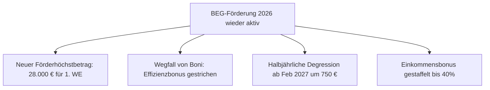
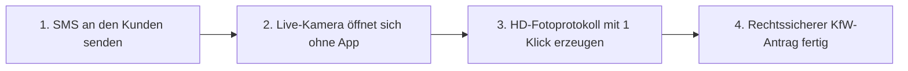

# BEG-Förderung 2026: Neue KfW-Regeln & wie SHK-Betriebe die Ansturm-Welle per Remote-Service meistern

* **Veröffentlichungsdatum:** 04.08.2026
* **Kategorie:** Service-Blog & Branchen-News
* **SEO Meta-Title:** `BEG-Förderung 2026: Neue Regeln & Remote-Service für SHK-Betriebe | tele-LOOK`
* **SEO Meta-Description:** `BEG-Förderung 2026 wieder gestartet: Alle neuen KfW & BAFA Regeln im Überblick + So dokumentieren Handwerksbetriebe den Bestand ohne Anfahrt per Video.`
* **Ziel-Keywords:** `BEG-Förderung 2026`, `KfW Heizungsförderung 28000 Euro`, `Remote Erstberatung Handwerk`, `tele-LOOK HD-Fotoprotokoll`, `Wärmepumpe Förderung Nachweis`

---

# BEG-Förderung 2026: Neue KfW-Regeln & wie SHK-Betriebe die Ansturm-Welle per Remote-Service meistern

Nach einem kurzen Förderstopp können Hausbesitzer und Betriebe seit dem 21. Juli 2026 wieder staatliche Anträge für den Heizungstausch und die energetische Gebäudesanierung bei der KfW und der BAFA stellen. Wie die *Deutsche Handwerks Zeitung (DHZ)* berichtet, ist die Erleichterung im Handwerk groß – allerdings haben sich die Förderbedingungen und Fristen spürbar verändert.

Für SHK-Handwerksbetriebe, Elektroinstallateure und Gebäudeenergieberater bedeutet der Neustart vor allem eines: **Das Telefon steht nicht mehr still.** Eigentümer verlangen sofortige Vorab-Einschätzungen und lückenlose Nachweise für ihre Förderanträge.

In diesem Beitrag fassen wir die wichtigsten gesetzlichen Neuerungen zusammen und zeigen, wie zukunftsorientierte Betriebe die Vorab-Dokumentation in unter 3 Minuten per Live-Video erledigen – ganz ohne Anfahrtskosten.

---

## Die wichtigsten Neuerungen der BEG-Förderung im Überblick

### 1. Gesenkter Förderhöchstbetrag für Wohngebäude
Für den Einbau einer klimafreundlichen Heizung (wie Wärmepumpen oder Hybridsystemen) gilt bei der KfW ab sofort ein verminderter Förderhöchstbetrag von **28.000 Euro für die erste Wohneinheit** (bisher 30.000 Euro). 
* Für die 2. bis 6. Wohneinheit betragen die förderfähigen Kosten je 15.000 Euro.
* Für jede weitere Wohneinheit je 8.000 Euro.

### 2. Halbjährliche Degression ab 2027
Wer den Heizungstausch aufschiebt, verliert bares Geld: Der Förderhöchstbetrag sinkt ab dem **1. Februar 2027 halbjährlich um jeweils 750 Euro**.

### 3. Wegfall von Boni & Strikte Antrags-Pflicht
* Der bisherige **Effizienzbonus** für Wärmepumpen mit natürlichen Kältemitteln ist entfallen.
* **Das goldene Gesetz:** Der Förderantrag muss **zwingend VOR Beginn des Bauvorhabens** (vor Liefer- oder Leistungsvertrag) gestellt werden.

---

## Das Problem für Handwerksbetriebe: Der Beratungsvorlauf kollabiert

Durch die neuen Regelungen wollen Kunden vor der Antragstellung garantiert wissen, ob ihre Immobilie die Voraussetzungen erfüllt und welcher Förderbaustein greift. 

Wenn ein SHK-Meister für jede unverbindliche Vorab-Besichtigung **45 Minuten hin- und 45 Minuten zurückfährt**, entstehen horrende Anfahrtskosten, die sich selten komplett abrechnen lassen. Wertvolle Handwerkerstunden gehen auf der Straße verloren.

---

## Die Lösung: Der 3-Minuten-Remote-Check mit tele-LOOK

Zukunftsorientierte SHK-Betriebe setzen auf **"Digital First"** in der Vorab-Beratung:

1. **Keine App-Hürde:** Der Meister sendet dem Kunden einen SMS-Link. Ein Klick genügt, und die Live-Kamera des Kunden-Smartphones überträgt das Bild direkt in den Browser des Meisters.
2. **Präzise Anleitung mit dem tele-PUNKT:** Der Meister tippt auf seinen PC-Bildschirm und setzt einen visuellen AR-Laserpunkt direkt auf den Zählerschrank, den Kessel oder den Rohrdurchmesser.
3. **Automatisches PDF-Fotoprotokoll:** Mit einem Klick erstellt tele-LOOK ein fälschungssicheres HD-Fotoprotokoll inklusive Notizen und Zeitstempel. Dieses Dokument dient direkt als sauberer Nachweis für die Förderakte.

---

## Wichtige Service-Kontakte & Förder-Links

Für Handwerksbetriebe, Berater und Kunden haben wir die offiziellen Antragsseiten und Hotlines zusammengestellt:

* **KfW – Heizungsförderung Privatpersonen (BEG EM 458):**  
  🔗 [www.kfw.de/458](https://www.kfw.de/458) | Hotline: `0800 5 39 90 13`
* **KfW – Heizungsförderung Unternehmen (BEG EM 459 & 522):**  
  🔗 [www.kfw.de/459](https://www.kfw.de/459) (Wohnen) | 🔗 [www.kfw.de/522](https://www.kfw.de/522) (Nichtwohngebäude)
* **BAFA – Energetische Einzelmaßnahmen (Dämmung, Gebäudenetz):**  
  🔗 [www.bafa.de/beg](https://www.bafa.de/beg) | Hotline: `06196 908 1625`
* **Bundesministerium für Wirtschaft (BMWE Energiewechsel):**  
  🔗 [www.energiewechsel.de](https://www.energiewechsel.de) | Hotline: `0800 0115 000`

---

## Fazit: Zeit sparen & Erstlösungsquote maximieren

Die BEG-Förderung 2026 bringt klare Spielregeln, verlangt von Handwerkern aber ein effizientes Kundenmanagement. Wer Vorab-Inspektionen per Live-Video durchführt, spart pro Fall bis zu 350 Euro Anfahrtskosten und beschleunigt den Förderantrag für seine Kunden um Tage.

**Möchten Sie tele-LOOK in Ihrem SHK-Betrieb testen?**  
👉 **[Jetzt 14 Tage kostenlos & unverbindlich testen – Keine Kreditkarte erforderlich](https://www.tele-look.com)**
