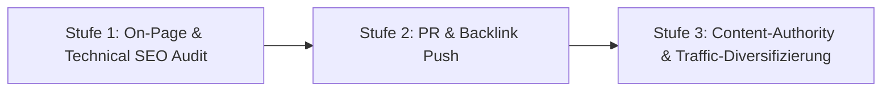

# Google SEO Push Strategie: In 3 Stufen zur Markt-Dominanz

> **Ziel:** tele-LOOK bei allen relevanten Suchanfragen auf Seite 1 bei Google zu platzieren, die CTR in den Suchergebnissen zu maximieren und die Domain-Autorität abzusichern.

---

## 1. DIE 3 STUFEN DES GOOGLE PUSH SYSTEMS

### Stufe 1: Technical SEO & On-Page Snippet-Optimierung (CTR-Booster)
*   **Speed- & Performance-Audit:** Mobil-Optimierung & WebP-Bildkomprimierung für maximale Ladedisziplin.
*   **CTR-Optimierte Meta-Tags:** Vermeidung von Standard-Metas. Überarbeitung nach dem Schema:  
    `[Primary Keyword] | [Hauptvorteil/ROI] – tele-LOOK` + `✓ Kein App-Download ✓ DSGVO-konform`.
*   **Structured Data (Schema.org):** Einbindung von `SoftwareApplication` & `FAQPage` Markup, um Sterne-Bewertungen und FAQ-Rich-Snippets direkt in den Google-Ergebnissen anzuzeigen.

### Stufe 2: PR- & Backlink-Push (Domain-Autorität aufbauen)
*   **openPR & PresseBox Release-Sprint:** Monatliche Veröffentlichung von keyword-optimierten Pressemitteilungen (Kategorie B & C Keywords im Titel für Google News Listung).
*   **Review-Portals (OMR Reviews & Capterra):** Einholen von 5-Sterne-Bewertungen glücklicher Kunden, um Platz 1 Vergleiche abzugreifen.
*   **Fachpresse Backlinks:** Verlinkungen aus Fachartikeln in *IKZ Haustechnik, KKA, MaschinenMarkt, Produktion*.

### Stufe 3: Content-Strategy & Multi-Kanal Traffic-Diversifizierung
*   **Frischer Content im Service-Newsroom:** Regelmäßige Publikation von Antworten auf konkrete Kundenfragen (z. B. *"So richten Sie die Fernwartung für Wärmepumpen rechtssicher ein"*).
*   **Multi-Kanal Traffic-Loops:** Social Media Posts (LinkedIn, Facebook), E-Mail Newsletter & Google Ads treiben fortlaufend qualifizierte Besucher auf die Landingpages und signalisieren Google hohe Nutzer-Relevanz.
