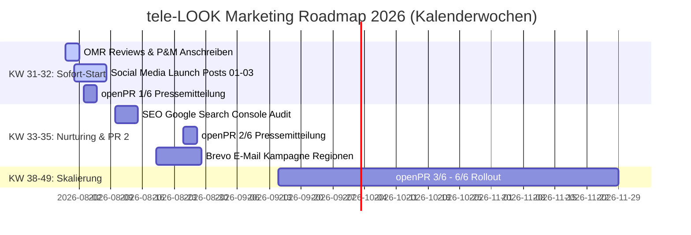

# Aktionsplan & KW-Zeitplan (Fahrplan 2026)

> **Zweck:** Verbindlicher Meilenstein-Zeitplan nach **Kalenderwochen (KW)** zur schrittweisen Abarbeitung aller Marketing-Maßnahmen für einen konsistenten Marktauftritt ab **KW 31 (30. Juli 2026)**.

---

## 1. SOFORT-ACTION-PLAN (KW 31: 27. JULI – 02. AUGUST 2026)

| Nr. | KW / Datum | Maßnahme | Kanal / Tool | Status |
| :--- | :--- | :--- | :--- | :--- |
| **1** | **KW 31 (30.07.)** | **5-Sterne-Bewertungs-Offensive** | OMR Reviews / Capterra | ⏳ Heute starten |
| **2** | **KW 31 (31.07.)** | **Pfeiffer & May Anschreiben** | E-Mail / Telefon | ⏳ Morgen senden |
| **3** | **KW 31 (01.08.)** | **Social Media Launch 01** | LinkedIn, Insta, Facebook | ⏳ Samstag Post 01 |
| **4** | **KW 32 (03.08.)** | **openPR 1/6 Pressemitteilung** | openPR Portal | ⏳ Montag Launch |
| **5** | **KW 32 (05.08.)** | **Fachpresse-Pitching (5 Redakteure)** | E-Mail Pitch 1 (IKZ/KKA) | ⏳ Mittwoch Pitch |

---

## 2. KALENDERWOCHEN-ROADMAP 2026 (KW 31 - KW 49)

