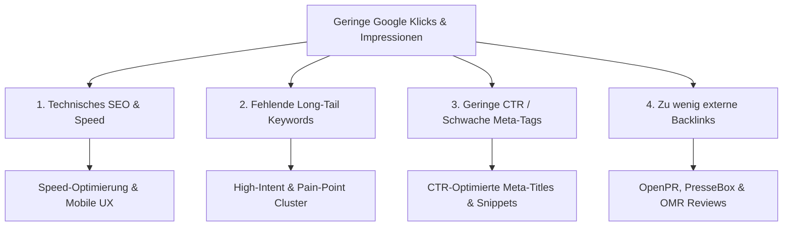

# Website Traffic-Diagnose & Technical SEO Audit Guide (tele-LOOK)

> **Zweck:** Diagnostischer Leitfaden zur Behebung von geringen Impressionen und Klicks in der Google Search Console (GSC) für `www.tele-look.com`.

---

## 1. URSACHEN-DIAGNOSE FÜR GERINGE GSC-IMPRESSIONEN & KLICKS

### Die 4 Haupt-Ursachen & Sofort-Maßnahmen:

#### A. Ineffektives Keyword-Targeting & Content-Lücken
* **Problem:** Die Seite rankt nur für sehr generische Begriffe oder verfehlt die konkreten Suchanfragen der Handwerksmeister.
* **Lösung:** Ausrichtung der H1-, H2- und Meta-Tags auf die definierten **High-Intent- & Pain-Point-Keywords** (`video support ohne app`, `fehlfahrten vermeiden kundendienst`).

#### B. Technische SEO-Engpässe & Mobile Performance
* **Problem:** Langsame Ladezeiten, fehlende mobile Optimierung oder fehlerhafte Indexierungs-Tags (`noindex`).
* **Lösung:**
  * Performance-Check via Google PageSpeed Insights (Ziel: Mobile Score > 90).
  * Prüfung der XML-Sitemap & Robots.txt in der Google Search Console.
  * Integration von Schema.org (`SoftwareApplication` & `FAQPage` Markup).

#### C. Geringe Click-Through-Rate (CTR) in den Suchergebnissen
* **Problem:** Die Website erscheint zwar sporadisch bei Suchanfragen, aber niemand klickt, weil Meta-Title & Description unsexy sind.
* **Lösung:** Überarbeitung aller Meta-Snippet-Texte nach der Formel:  
  `[Keyword] | [Nutzen/ROI] - tele-LOOK` + `✓ Kein App-Download ✓ DSGVO-konform`.

#### D. Fehlende Backlinks & Domain-Autorität
* **Problem:** Neue oder wenig verlinkte Domains haben bei Google geringes Vertrauen (Domain Authority).
* **Lösung:** Gezielter Backlink-Aufbau über **openPR**, **PresseBox**, Gastbeiträge in Fachmagazinen (*IKZ, KKA*) & Einträge auf **OMR Reviews / Capterra**.

---

## 2. SYSTEMATISCHER SCHRITT-FÜR-SCHRITT HANDLUNGSPLAN

### Schritt 1: Technical SEO & Speed Push
1. Bildgrößen auf der Website komprimieren (WebP-Format).
2. Browser-Caching & Content Delivery Network (CDN) aktivieren.
3. Mobile Responsiveness auf allen Endgeräten testen.

### Schritt 2: On-Page Snippet-Optimierung (CTR-Booster)
* **Startseiten Meta-Title:** `Live-Video-Support Handwerk | Fehlfahrten reduzieren – tele-LOOK`
* **Startseiten Meta-Description:** `tele-LOOK: Browserbasierter Remote-Support für SHK, Elektro & FM. Vermeiden Sie Anfahrtskosten & leiten Sie Techniker remote an. ✓ Ohne App-Download ✓ DSGVO-konform.`

### Schritt 3: Multi-Kanal Traffic-Treiber (Verstärker)
Da organisches SEO Zeit braucht (3-6 Monate), wird der Traffic sofort über 3 parallele Kanäle gepusht:
1. **Google Ads Low-Budget:** Sofortiger Traffic für `video support ohne app`.
2. **Social Media Traffic:** Verlinkung aller LinkedIn- & Facebook-Beiträge auf spezifische Landingpages.
3. **E-Mail-Marketing:** Lead-Nurturing-Sequenzen mit Links zum Service-Blog.
